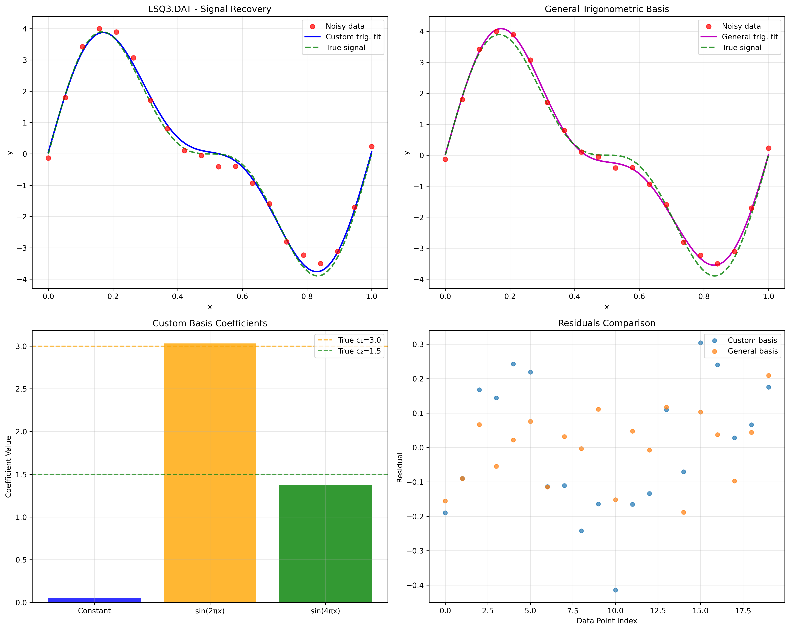

# Least Squares Method Implementation

## Overview

A comprehensive Python implementation of the Least Squares Method for data approximation using various basis functions. This project focuses on solving overdetermined systems using different approximation approaches.

## Features

- **Multiple Basis Functions**: Polynomial, Legendre polynomial, and trigonometric basis functions
- **Weight Matrix Support**: Identity and arbitrary diagonal weight matrices
- **Multiple Solution Methods**: Gaussian elimination and Conjugate Gradient method
- **Comprehensive Analysis**: Condition number analysis, residual tracking, and convergence monitoring

## Mathematical Foundation

The least squares method solves the overdetermined linear system:

```t
A^T * B * A * x = A^T * B * y
```

Where:

- `A` is the design matrix constructed from basis functions
- `B` is the weight matrix (identity or arbitrary diagonal)
- `x` are the unknown coefficients
- `y` is the observed data vector

### Basis Functions

#### 1. Polynomial Basis

```t
φ_j(x) = x^j, j = 0, 1, 2, ..., n
```

Approximation: `y(x) = Σ b_j x^j`

#### 2. Legendre Polynomial Basis

```t
φ_j(x) = P_j(x), j = 0, 1, 2, ..., n
```

Approximation: `y(x) = Σ b_j P_j(x)`

Where `P_j(x)` are Legendre polynomials normalized to [-1, 1].

#### 3. Trigonometric Basis

```t
φ_0(x) = 1, φ_{2k-1}(x) = sin(2πkx), φ_{2k}(x) = cos(2πkx)
```

Approximation: `y(x) = b_0 + Σ[b_{2k-1} sin(2πkx) + b_{2k} cos(2πkx)]`

## Project Structure

```t
lab_week_3/
├── least_squares_solver.py     # Core solver implementation
├── least_squares_analysis.py   # Analysis and visualization tools
├── generate_data.py            # Data generation utilities
├── DATA/                       # Generated data files
│   ├── LSQ1.DAT                # Linear relationship data
│   ├── LSQ2.DAT                # Polynomial relationship data
│   ├── LSQ3.DAT                # Trigonometric signal data
│   └── LSQ4.DAT                # Function table data
│
├── graphs/                     # Generated visualizations
├── README.md                   # This documentation
└── requirements.txt            # Python dependencies
```

## Data Files Description

### LSQ1.DAT - Linear Relationship

- **Purpose**: Basic linear approximation `y = b₀ + b₁x`
- **Points**: 5 data points
- **True parameters**: b₀ = 2.5, b₁ = 1.8
- **Noise level**: Low (σ = 0.1)

### LSQ2.DAT - Higher Degree Polynomial

- **Purpose**: Complex polynomial requiring higher degree approximation
- **Points**: 15 data points
- **True polynomial**: 4th degree
- **Noise level**: Moderate (σ = 0.3)

### LSQ3.DAT - Trigonometric Signal

- **Purpose**: Signal recovery `y(x) = c₁sin(2πx) + c₂sin(4πx)`
- **Points**: 20 data points over [0, 1]
- **True coefficients**: c₁ = 3.0, c₂ = 1.5
- **Noise level**: Low-moderate (σ = 0.2)

### LSQ4.DAT - Function Table

- **Purpose**: Trigonometric polynomial comparison
- **Points**: 32 data points (good for FFT analysis)
- **Content**: Multi-harmonic function with various frequency components
- **Noise level**: Very low (σ = 0.05)

### Solution Methods

#### Gaussian Elimination

- Direct solution of normal equations
- Optimal for well-conditioned systems
- Fast computation for small to medium problems

#### Conjugate Gradient Method

- Iterative solution for large systems
- Particularly effective for symmetric positive definite matrices
- Includes convergence monitoring and residual tracking

## Analysis Results

### LSQ1.DAT Analysis

- Compares polynomial vs Legendre basis for linear approximation
- Demonstrates weight matrix effects
- Shows basis function equivalence for simple cases


### LSQ2.DAT Analysis

- Polynomial degree selection analysis
- Condition number degradation with increasing degree
- Method comparison (Gaussian vs Conjugate Gradient)
- Polynomial vs Legendre numerical stability


### LSQ3.DAT Analysis

- Signal recovery from noisy measurements
- Custom trigonometric basis performance
- Coefficient accuracy assessment
- Comparison with general trigonometric basis



### LSQ4.DAT Analysis

- Trigonometric polynomial comparison (degrees m and m+r)
- Coefficient stability analysis
- Approximation quality vs polynomial degree
- Explanation of coefficient similarity for first m terms


## Visualizations

The analysis generates comprehensive plots:

1. **Data and Approximations**: Original data with fitted curves
2. **Residual Analysis**: Residual patterns and distributions
3. **Convergence Plots**: Method convergence behavior  
4. **Coefficient Comparison**: Basis function coefficient analysis
5. **Error Analysis**: RMS error vs approximation parameters
6. **Condition Number Trends**: Numerical stability assessment

## Running the Analysis

### Generate Data Files

```bash
python3 generate_data.py
```

### Run Complete Analysis

```bash  
python3 least_squares_analysis.py
```
